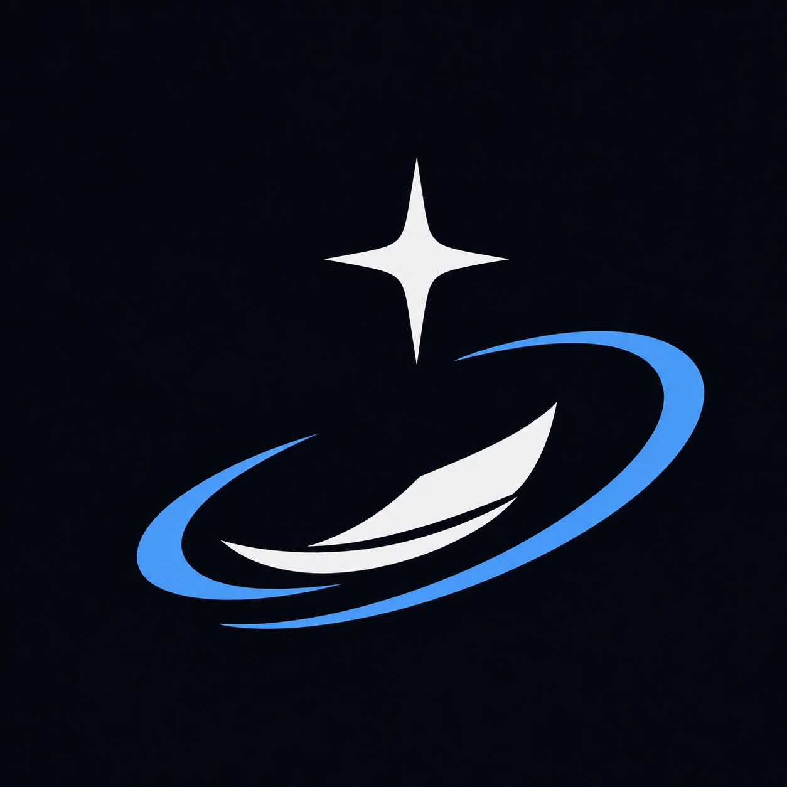
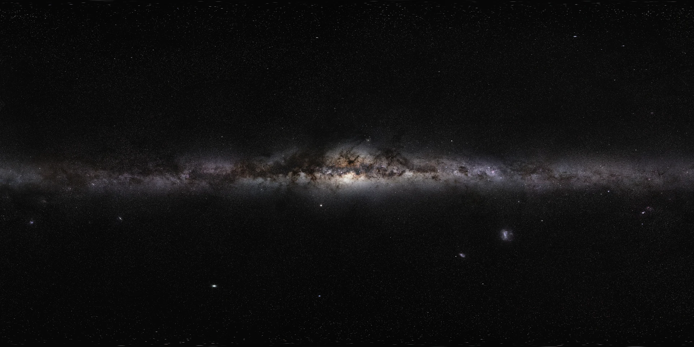
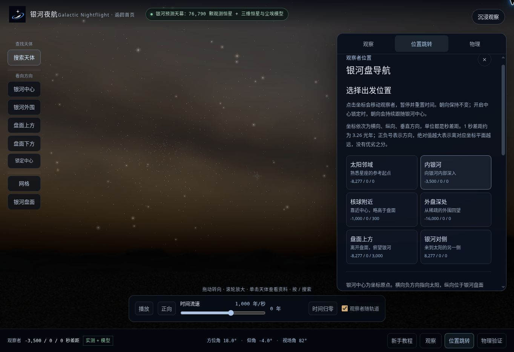
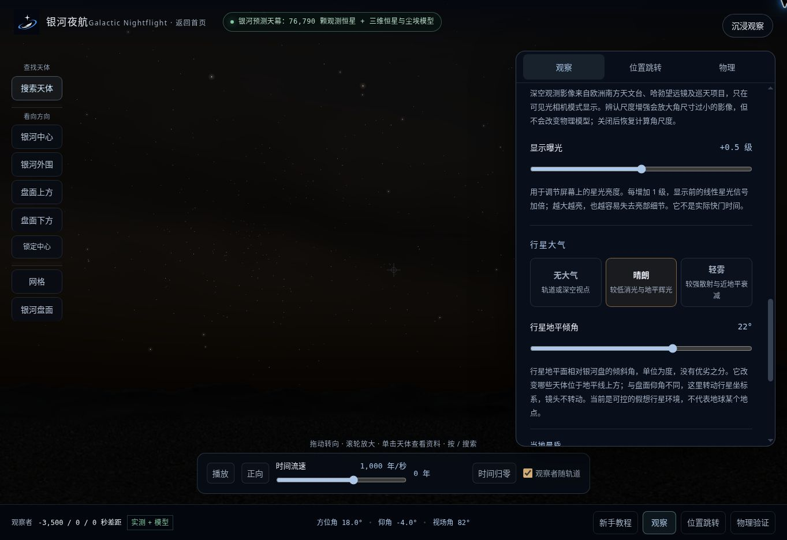
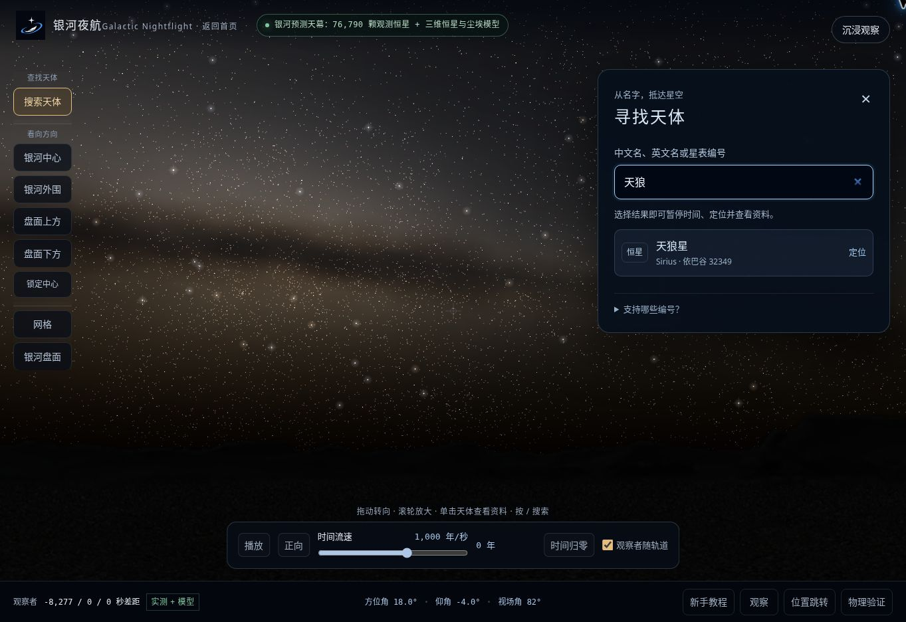
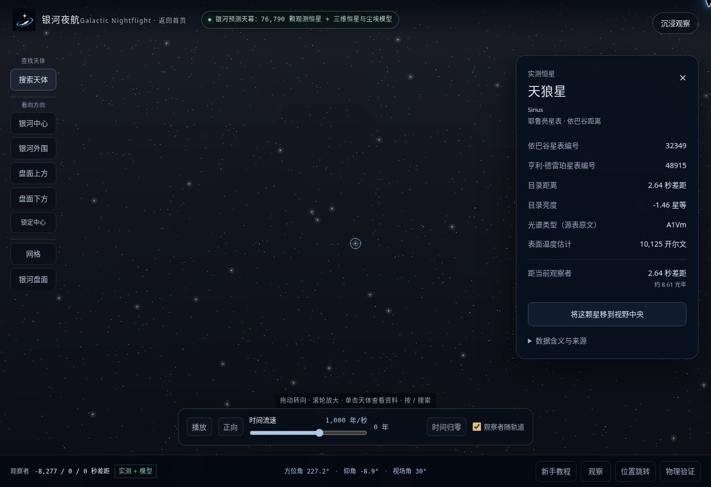
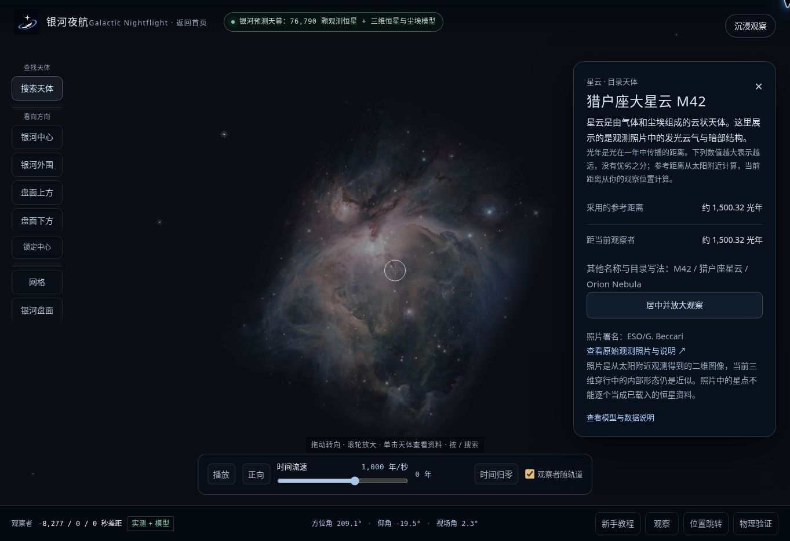
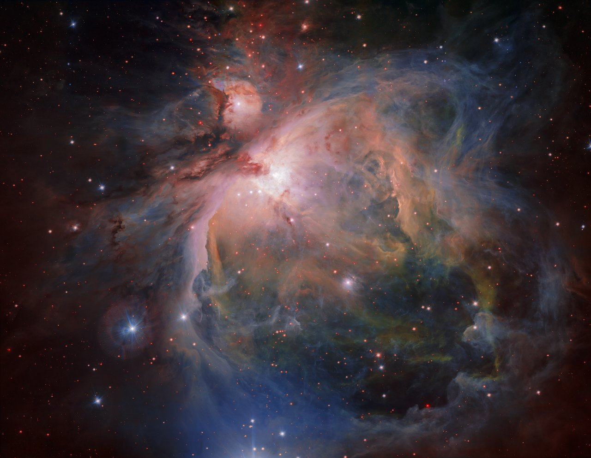
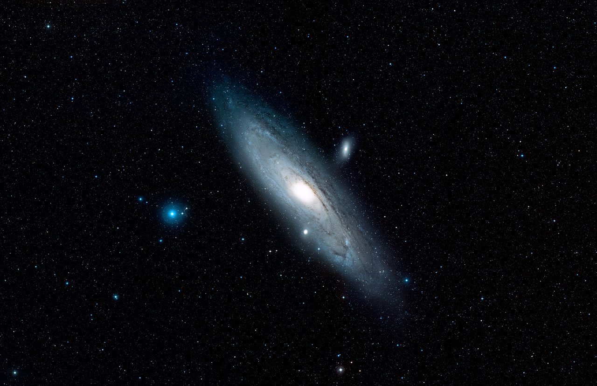

# 银河夜航

**Galactic Nightflight**

### 同一片银河，不同的星空。

如果站在银河另一处的星球上，抬头望见的是怎样的星空？

**[访问网站](https://nightflight.xelope.fun/) · [进入观星平台](https://nightflight.xelope.fun/observe) · [English](README.en.md)**

浏览器中运行 · 三维空间漫游 · 实测星表与模型 · MIT 开源

项目首页使用的银河全景照片 · © ESO/S. Brunier · <a href="https://www.eso.org/public/images/eso0932a/">原始影像</a> · 知识共享署名 4.0（CC BY 4.0）

---

**[项目介绍](#项目介绍) · [实际界面](#实际界面) · [功能一览](#功能一览) · [开始观星](#开始观星) · [数据与模型](#数据与模型) · [本地运行](#本地运行) · [参与项目](#参与项目) · [许可证](#许可证)**

## 项目介绍

银河夜航是一个以观察者位置为起点的三维星空模拟器。你可以留在太阳附近辨认熟悉的恒星，也可以前往银河内侧、外盘或盘面上方，再看同一片银河。

移动时，程序根据天体与观察者的三维相对位置，重新计算天空中的方向、距离和亮度；银河的连续辉光与尘埃遮挡也随观察位置重新求解。晨昏、大气和感光设置则决定这片星空如何呈现。

项目把实测数据、统计模型与艺术素材分别标明。它适合探索与直观理解；目前仍是交互式近似模拟，科学范围见下方[说明](#科学范围与限制)。

| 在线入口 | 内容 |
| --- | --- |
| **[nightflight.xelope.fun](https://nightflight.xelope.fun/)** | 中文首页，项目介绍与星空穿行动效 |
| [直接观星](https://nightflight.xelope.fun/observe) | 全屏天幕与观察工具 |
| [English homepage](https://nightflight.xelope.fun/en) | 英文首页；观星平台目前使用中文界面 |
| [备用地址](https://galactic-sky-physics.blush-eel-3740.chatgpt.site/) | 同一网站的原始托管地址 |

网站已公开，可通过链接访问，无需安装。

## 实际界面

以下截图来自当前项目的实际操作页面。截图中的观星界面使用中文；英文版说明提供对应操作指引。

网站“使用”区域提供真实操作动图，只播放当前可见的演示，也可切回静态图：[转动视线](public/guide/look.gif) · [位置跳转](public/guide/move.gif) · [天体查询](public/guide/inspect.gif)。

### 移动到银河的另一处

打开底部“位置跳转”，选择“内银河”。下图已完成位置切换：右侧显示六个预设位置，左下角同步更新观察者坐标。位置决定站在哪里，左侧方向按钮决定朝哪里看。

### 调整大气与显示亮度

打开“观察”，向下滚动到“显示曝光”和“行星大气”。这里可以调节屏幕亮度，选择无大气、晴朗或轻雾，并改变行星地平倾角；继续向下可设置当地晨昏。

### 搜索恒星，再查看它的数据

点击左侧“搜索天体”，输入“天狼”。选择结果后，程序将天狼星移到视野中央，并打开实测资料：目录编号、距离、亮度、温度估计，以及距当前观察者的距离。

<table>
  <tr>
    <td width="50%"><strong>输入名称，找到目标</strong></td>
    <td width="50%"><strong>定位目标，查看资料</strong></td>
  </tr>
  <tr>
    <td></td>
    <td></td>
  </tr>
</table>

点击任一图片可放大阅读。搜索也支持英文名称和已加载目录的编号。

### 查看星云特写与影像来源

在“观察”中选择“猎户座大星云 · 特写”，即可进入相机特写，并查看距离、其他名称和原始影像链接。星团与星系也有可查询的目录目标。

截图中的星云影像：© ESO/G. Beccari · <a href="https://www.eso.org/public/images/eso1723a/">原始照片</a> · 知识共享署名 4.0（CC BY 4.0）。相机特写中的照片色彩不代表裸眼颜色。

## 功能一览

| 功能 | 可以做什么 |
| --- | --- |
| **空间漫游** | 在六个预设位置间跳转，或用银河位置图与距离控件调整观察点。恒星逐颗重新投影。 |
| **方向与追踪** | 拖动天幕、调整视场角，快速看向银河中心、外围或盘面上下；打开中心锁定后，移动时持续看向银河中心。 |
| **时间推进** | 播放、暂停、倒放，以每现实秒 1–100,000 模拟年的速度预览运动；可让观察者随近似轨道运动。 |
| **晨昏与大气** | 切换无大气、类地晴空和轻雾，调整当地恒星的高度与方位，比较深夜、暮光和白昼。 |
| **感光响应** | 比较裸眼、暗适应、可见光相机与近红外显示；分别控制观测影像和沉浸增强。 |
| **天体查询** | 按名称或目录编号搜索已加载天体；点选实测恒星、星云、星团和星系，查看可用数据与来源。 |
| **沉浸观察** | 收起面板，让天幕占满视野。地景随相机投影变化，首次进入提供可重开的新手教程。 |

首页的滚动与导航带动连续的星辰穿行动效；动画可以暂停，并遵循系统的“减少动态效果”设置。首页摄影与动效用于项目介绍。

## 开始观星

1. **进入平台，完成引导。** 打开[观星平台](https://nightflight.xelope.fun/observe)，首次访问会出现七步教程。底部“新手教程”可随时重开。
2. **先改变位置，再比较天空。** 打开“位置跳转”，从太阳邻域前往内银河或盘面上方。左侧按钮控制看向的方向；位置面板控制你在哪里。
3. **选择观察条件。** 在“观察”中调整感光、晨昏与大气。先暂停时间比较静态视差，再开启播放观察运动。

### 六个出发点

| 位置 | 适合探索 |
| --- | --- |
| **太阳邻域** | 从熟悉的星空开始，搜索与点选实测恒星。 |
| **内银河** | 向内部移动，比较附近恒星的相对方向与亮度。 |
| **核球附近** | 从略高于盘面的位置观察银河中央区域。 |
| **外盘深处** | 从外围回望银河，比较前景恒星与连续星光。 |
| **盘面上方** | 离开盘面，观察银河带的形状与尘埃遮挡变化。 |
| **银河对侧** | 来到太阳所在位置的另一侧，换一个方向看银河。 |

这些是银河空间坐标预设；行星地景是用于观察的假想环境。

### 常用操作

| 操作 | 效果 |
| --- | --- |
| 按住并拖动天幕 / 触摸拖动 | 转动视线 |
| 鼠标滚轮 | 缩放视场 |
| 单击可查询天体 | 打开恒星或深空天体资料 |
| `/` | 打开天体搜索 |
| `Esc` | 关闭搜索或天体选择 |
| 方向键、`+` / `-` | 天幕获得焦点后，转向或缩放 |
| “锁定中心” | 移动位置或推进时间时持续追踪中心 |
| “新手教程” | 重新打开引导；完成记录保存在当前浏览器 |

想自由转向时，关闭中心锁定。找不到目标时，先确认它是否在已加载目录中，以及是否位于当前地平线以上。

## 观测影像

项目使用有来源记录的天文照片丰富首页，并为部分深空天体提供可关闭的影像层。观星平台按天体方向和角尺度投影这些照片。下面展示的是项目所用观测素材。

<table>
  <tr>
    <td width="50%"></td>
    <td width="50%"></td>
  </tr>
  <tr>
    <td><strong>猎户座大星云</strong> © ESO/G. Beccari · CC BY 4.0</td>
    <td><strong>仙女座星系</strong> NASA, ESA, Digitized Sky Survey 2 Acknowledgement: Davide De Martin · CC BY 4.0</td>
  </tr>
</table>

曝光、波段与显示处理会影响照片的颜色；照片色彩不能直接视为裸眼所见。完整来源与许可见 [第三方声明](THIRD_PARTY_NOTICES.md)。

## 数据与模型

程序先计算“天体位置 − 观察者位置”，得到相对方向与距离；再结合恒星光度、沿途尘埃、观察条件和相机姿态，得到屏幕上的星空。

| 组成 | 当前内容 | 依据与用途 |
| --- | --- | --- |
| **实测亮星** | 7,369 颗具有可用距离的亮星 | 耶鲁亮星表整理数据与 Hipparcos 距离，补充明亮端。见[来源记录](public/data/bright-star-catalog-source.json)。 |
| **Gaia 实测样本** | 69,421 颗恒星 | 盖亚第三批数据发布（Gaia DR3）的明亮子样本，包含三维位置与三维速度。见[筛选与来源](public/data/gaia-dr3-bright-6d-source.json)。 |
| **统计模型恒星** | 73,728 个固定模型源 | 按薄盘、厚盘、棒与核球、核区、恒星晕的参数化分布生成，保留位置和速度。见[模型代码](lib/rendering/model-star-catalog.ts)。 |
| **银河连续光与尘埃** | 三维发光与吸收积分 | 沿视线累积无法逐颗分辨的恒星光，并计算尘埃吸收与红化。见[积分实现](lib/rendering/galaxy-radiance.ts)。 |
| **银河系外天体** | 近邻星系目录与 2,048 个统计背景星系 | 目录目标有观测依据，统计背景不对应逐个已确认的真实星系。见[目录实现](lib/rendering/extragalactic-catalog.ts)。 |
| **影像与地景** | 天文观测照片、生成的标志与岩石地貌 | 照片作为影像层；地貌属于假想行星环境。见[素材声明](THIRD_PARTY_NOTICES.md)。 |

以上数字是当前目录或模型规模，不代表每个视野的可见数量，也不代表完整银河星表。模型恒星是统计样本，不能作为真实天体身份查询的依据。

### 科学范围与限制

- **覆盖范围有限。** 当前使用观测子样本与参数化模型，尚未完成全银河星数、不同观测波段和绝对光通量的一致标定。
- **运动用于预览。** 恒星采用固定初速度外推，观察者使用近似引力势中的轨道积分。长时间推进不能视为逐星高精度轨道预测。
- **大气与感光采用近似。** 类地大气、暗适应和相机响应用于比较观察条件；它们不代表某个真实地点的天气或具体相机标定。近红外显示也不等同于人眼颜色。
- **深空照片保留二维信息。** 天体中心会随观察位置重新投影，但照片不能还原从任意方向看去的完整内部三维结构。
- **科学核验与画面预览分开。** 仓库保留更严格的科学制品检查；交互模式可运行，不等于所有高精度数据条件已经满足。

更多细节：[科学与显示说明](public/data/SCIENCE_DISPLAY_UPDATE.md) · [数据目录](public/data) · [第三方来源](THIRD_PARTY_NOTICES.md)。

## 本地运行

需要 **Node.js 22.13 或更高版本**（JavaScript 运行环境）与 npm。构建脚本使用 Bash 和 GNU `timeout`；推荐 Linux，Windows 可使用 WSL（Windows 的 Linux 子系统）。其他系统需先提供相同命令。

~~~bash
git clone https://github.com/LopoaySyen/galactic-nightflight.git
cd galactic-nightflight
npm ci
npm run dev
~~~

开发服务会输出本地访问地址。仓库包含运行所需的星表子样本与图片，不需要天文服务密钥或数据库。

### 检查与构建

~~~bash
npm run typecheck
npm run test:core
npm run build
node --test tests/*.test.mjs
~~~

最后一条命令包含构建产物检查，因此放在构建完成后执行。也可以用 `npm test` 一次完成构建与全部测试。

### 工程结构

| 位置 | 内容 |
| --- | --- |
| [`app/`](app) | 中文与英文首页、全屏观星平台、页面与交互 |
| [`lib/physics/`](lib/physics) | 坐标、距离、测光、尘埃与动力学 |
| [`lib/observation/`](lib/observation) | 人眼、相机与光传播时间相关计算 |
| [`lib/rendering/`](lib/rendering) | 天球投影、星表、影像合成、后台计算与显卡绘制 |
| [`lib/landing/`](lib/landing) | 首页文案、导航与星辰穿行动效 |
| [`public/`](public) | 星表、来源记录、标志、天文照片与地景 |
| [`tests/`](tests) | 物理、交互逻辑、架构与构建输出检查 |
| [`scripts/`](scripts) | 数据生成、构建与公开源码导出工具 |

界面使用 React 与 TypeScript；Vite / vinext 负责开发和构建，生产输出面向 Cloudflare Workers。`dist` 为构建目录。公开托管配置保留通用设置，自行部署时需配置自己的托管项目与域名。

维护者：导出公开源码快照

~~~bash
node scripts/export-public-source.mjs /absolute/path/to/new-directory
~~~

导出工具会排除依赖缓存、构建结果、私有历史和原站点标识，并检查常见凭证格式。目标应为新的独立目录。

## 参与项目

欢迎通过 [Issues](https://github.com/LopoaySyen/galactic-nightflight/issues) 反馈问题，或提交改进代码。报告显示或性能问题时，请附上浏览器与设备、观察位置、感光和大气设置，以及能重现问题的操作步骤；涉及时间推进时，也请记录流速与模拟时间。

补充天文数据或影像时，请同时给出来源、许可、单位、坐标系和适用范围。修改物理或投影逻辑时，请附上能够验证结果的数值依据或测试。

作者：[LopoaySyen](https://github.com/LopoaySyen) · 项目引用信息：[CITATION.cff](CITATION.cff)

## 许可证

原创代码采用 **[MIT 许可证](LICENSE)**，允许使用、修改、分发与商用，无需另行获得作者授权；软件副本或实质性部分须保留版权与许可声明。

第三方星表、照片与依赖保留各自的许可，使用或再分发时请查看相应来源。

[版权与来源](NOTICE) · [第三方声明](THIRD_PARTY_NOTICES.md) · [使用与引用说明](COMMERCIAL-LICENSING.md)

---

**[出发观星 ↗](https://nightflight.xelope.fun/observe)**

[中文](README.md) · [English](README.en.md)

